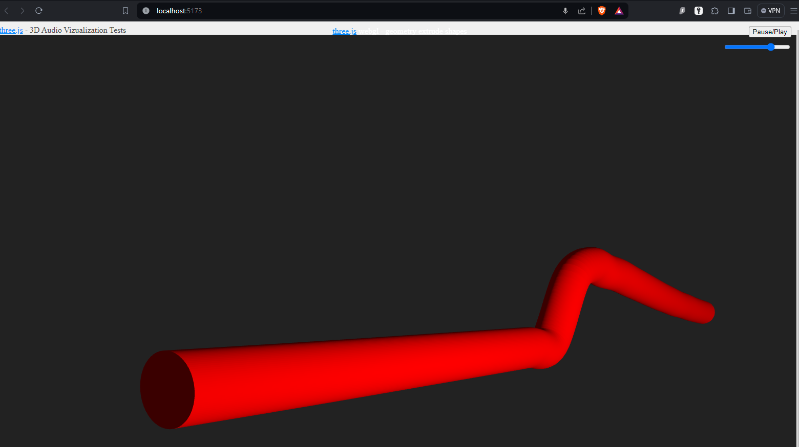

## 3DAudioViz
#### This is a test of combining 3JS with the Web Audio API

This vizualization uses the microphone to render a 3D cylindrical line which changes based on the average input gain. 
There are controls for adjusting the speed of the animation. 



#### Installation
To run the vizualization, you will need to install node and npm. Follow installation instructions for your OS.
<br>
https://nodejs.org/en
<br>
https://www.npmjs.com/
<br>
Once installed, open the project to the directory where you see index.html and use npm to install 3JS and vite (a runtime tool to server your files)
```
npm install --save three
npm install --save-dev vite
```

Run the project with this command:
```
npx vite
```

Then, it should give you a localhost URL to open. Grant permissions to use your microphone, and when the animation begins you should see the 3D line move with audio input. You may need to click the viz to get an audio permissions prompt. You can use the slider to adjust animation speed and play/pause to stop and start the animation. 
<br>
The color of the line is a known bug :D

#### Resources
3JS
https://threejs.org/examples
<br>

Web Audio API
https://mdn.github.io/webaudio-examples/
<br>

This code was adapted from a 3JS example spline animation
https://threejs.org/examples/#webgl_geometry_extrude_shapes
<br>
